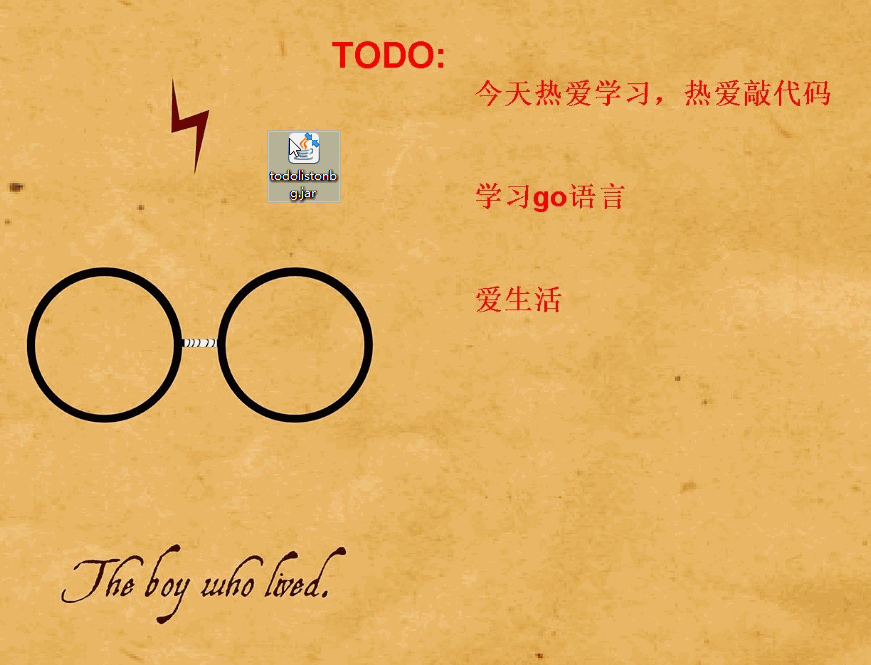

# todolistonbg
让你:business_suit_levitating: 的日常安排⏰ 显示在壁纸上

难度系数：:zero:

学习价值：:zero:

想交流一哈: 775656764@qq.com

> 程序由来

* 重量级第三方太麻烦，占内存，拖过来，拖过去的
* 轻量级第三方没保障，挺麻烦，拖过来，拖过去的
* 在壁纸上 **提神醒脑** 
* 让世界上没有完不成的**TODOLIST**
* 太闲了，蛋疼。。。。。

> 条件

* 必须windows哦
* 必须该壁纸设置为幻灯片哦
* 必须有jre环境哦

> 编写原理

* 使用C/C++写，emmm嫌弃电脑少了库，直接改注册表多方便
* 使用Python写，emmm嫌弃电脑少了库，不太熟悉
* 使用JS写，emmm感觉无法操作
* 使用Java写，改注册表嫌麻烦，加危险，直接使用windows的幻灯片壁纸环境吧（对于他的换壁纸方案自己尝试得出）

